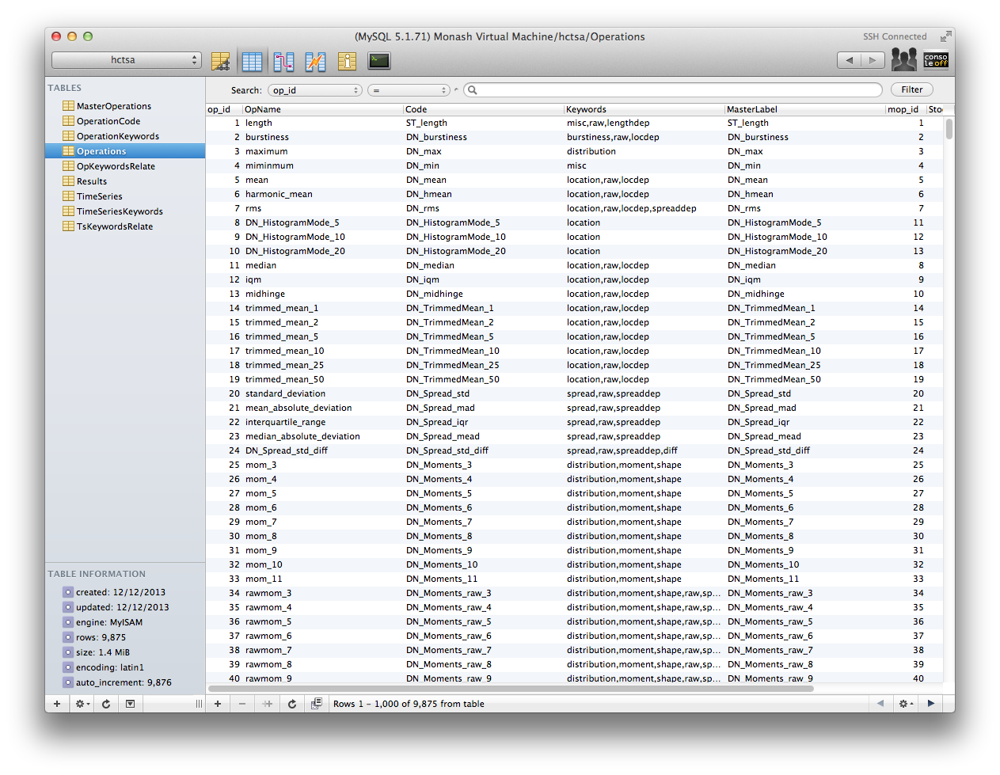

# The database structure
<!--### Creating the database structure-->
<!--{#sec:DatabaseStructure}-->

The *mySQL* database is structured into four main components:

1. A lists of all the filenames and other metadata of time series (the **TimeSeries** table),
2. A list of all the names and other metadata of pieces of time-series analysis operations (the **Operations** table),
3. A list of all the pieces of code that must be evaluated to give each operation a value, which is necessary, for example, when one piece of code produces multiple outputs (the **MasterOperations** table), and
4. A list of the results of applying operations to time series in the database (the **Results** table).

Additional tables are related to indexing and managing efficient keyword labelling, etc.

Time series and operations have their own tables that contain metadata associated with each piece of data, and each operation, and the results of applying each method to each time series is in the **Results** table, that has a row for every combination of time series and operation, where we also record calculation times and the quality of outputs (for cases where there the output of the operation was not a real number, or when some error occurred in the computation).
Note that while the time-series data *is* stored on the database, the executable time-series analysis code
files are not such that all code files must be in Matlab’s path (all paths can be set by running `startup.m`).
<!--, explained [here](#sec:SettingThePath).-->

Another handy (but dangerous) function to know about is `SQL_reset`, which will ***delete all data in the mySQL database***, create all the new tables, and then fill the database with all the time-series analysis operations.
The **TimeSeries**, **Operations**, and **MasterOperations** tables can be generated by running `SQL_create_all_tables`, with master operations and operations added to the database using `SQL_add` commands (described [here](populating.md)).

You now you have the basic table structure set up in the database and have done the first bits of *mySQL* manipulation through the Matlab interface.

It is very useful to be able to inspect the database directly, using a graphical interface.
A very good example for Mac is the excellent, free application, [*Sequel Pro*](http://www.sequelpro.com) (a screenshot is shown below, showing the first 40 rows of the Operations table of our default operations library).
Applications similar to *Sequal Pro* exist for Windows and Linux platforms.
Applications that allow the database to be inspected are extremely useful, however they should ***not*** be used to manipulate the database directly.
Instead, Matlab scripts should be used to interact with the database to ensure that the proper relationships between the different tables are maintained (including the indexing of keyword labels).

<!--Visualizing the **Operations** table in the database using *Sequel Pro* for Mac. Similar applications exist for Windows and Linux platforms. -->
