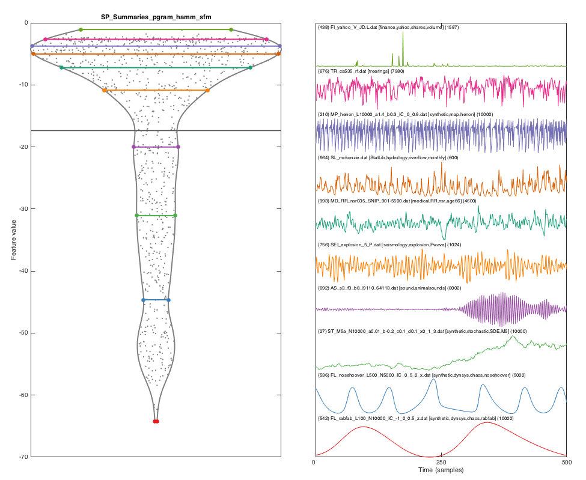
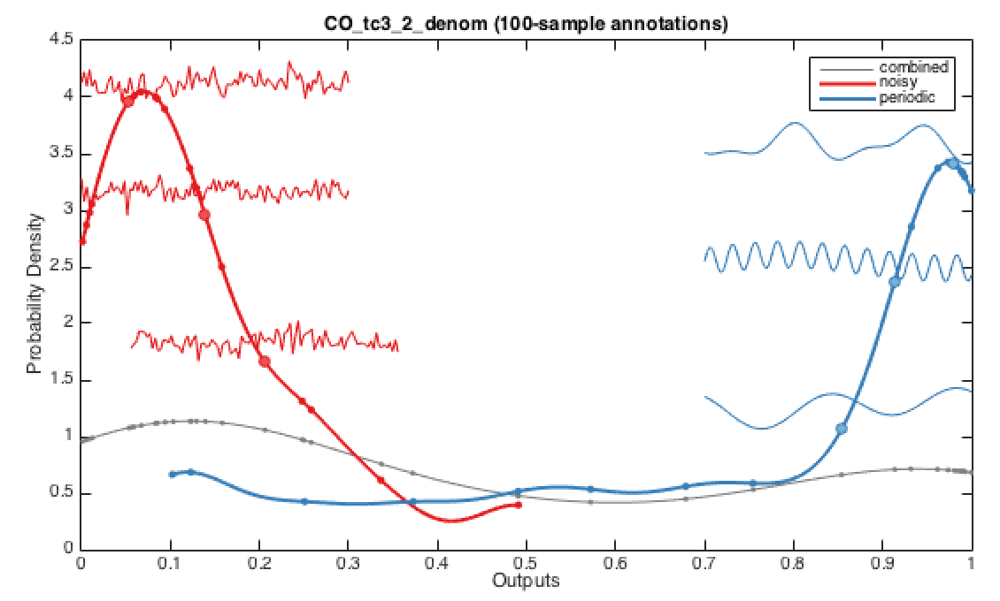
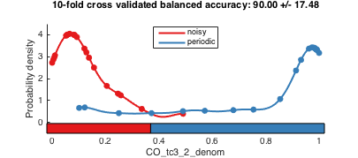
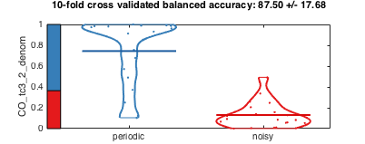

# Investigating specific features using `TS_FeatureSummary`

Sometimes it's useful to be able to investigate the behavior of an individual operation \(or feature\) across a time-series dataset.  
What are the distribution of outputs, and what types of time series receive low values, and what receive high values?

These types of simple questions for specific features of interest can be investigated using the `TS_FeatureSummary` function.  
The function takes in an operation ID as it's input \(and can also take inputs specifying a custom data source, or custom annotation parameters\), and produces a distribution of outputs from that operation across the dataset, with the ability to then annotate time series onto that plot.

For example, the following:

```matlab
    TS_FeatureSummary(100)
```

Produces the following plot \(where 6 points on the distribution have been clicked on to annotate them with short time-series segments\):


You can visually see that time series with more autocorrelated patterns through time receive higher values from this operation.  
Because no group information is present in this dataset, the time series are colored at random.

Running TS\_FeatureSummary in violin plot mode provides another representation of the same result:

```
annotateParams = struct('maxL',500);
TS_FeatureSummary(4310, 'raw', 1, annotateParams);
```

This plots the distribution of feature 4310 from `HCTSA.mat` as a violin plot, with ten 500-point time series subsegments annotated at different points through the distribution, shown to the right of the plot:



## Plotting for labeled groups of time series

When time series groups have been labeled \(using [`TS_LabelGroups`](grouping.md) as: `TS_LabelGroups({'seizure','eyesOpen','eyesClosed'},'raw');`\), `TS_FeatureSummary` will plot the distribution for each class separately, as well as an overall distribution.  
Annotated points can then be added to each class-specific distributions.  
In the example shown below, we can see that the 'noisy' class \(red\) has low values for this feature \(`CO_tc3_2_denom`\), whereas the 'periodic' class mostly has high values.



## Simpler distributions

`TS_SingleFeature` provides a simpler way of seeing the class distributions without annotations, as either kernel-smoothed distributions, as in `TS_FeatureSummary`, or as violin plots.  
See below for example implementations:

```
opid = 500; makeViolin = false;
TS_SingleFeature('raw',opid,makeViolin);
```

Shows the distributions with classification bar underneath \(for where a linear classifier would classify different parts of the space as either noisy or periodic\):



```
opid = 500; makeViolin = true;
TS_SingleFeature('raw',opid,makeViolin);
```

Shows the distributions shown as a violin plot, with means annotated and classification bar to the left:



Note that the title, which gives an indication of the 10-fold cross-validated balanced accuracy of a linear classifier in the space is done on the basis of a single 10-fold split and is stochastic.  
Thus, as shown above, this can yield slightly different results when repeated.  
For a more rigorous analysis than this simple indication, the procedure should be repeated many more times to give a converged estimate of the balanced classification accuracy.

