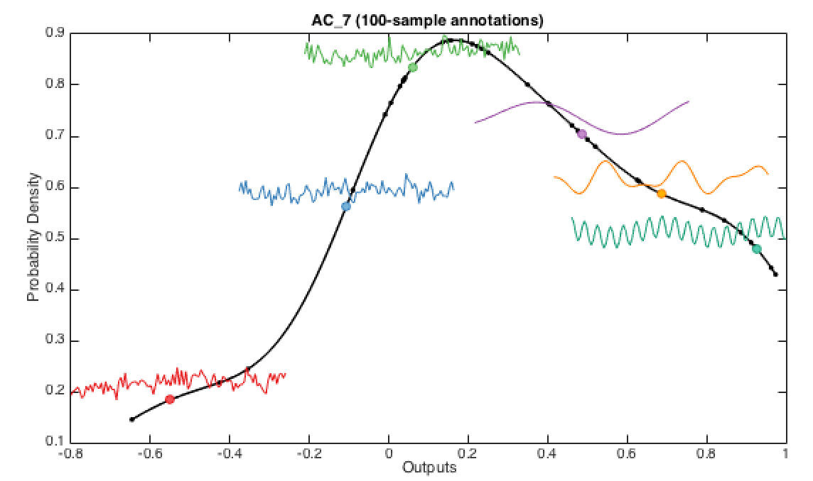

# Investigating specific features using `TS_FeatureSummary`

Sometimes it's useful to be able to investigate the behavior of an individual operation (or feature) across a time-series dataset.
What are the distribution of outputs, and what types of time series receive low values, and what receive high values?

These types of simple questions for specific features of interest can be investigated using the `TS_FeatureSummary` function.
The function takes in an operation ID as it's input (and can also take inputs specifying a custom data source, or custom annotation parameters), and produces a distribution of outputs from that operation across the dataset, with the ability to then annotate time series onto that plot.

For example, the following:

    TS_FeatureSummary(100)

Produces the following plot (where 6 points on the distribution have been clicked on to annotate them with short time-series segments):

You can visually see that time series with more autocorrelated patterns through time receive higher values from this operation.
Because no group information is provided, time series are colored at random.

## Plotting for labeled groups of time series

When time series groups have been labeled (using [`TS_LabelGroups`](grouping.md) as: `TS_LabelGroups({'seizure','eyesOpen','eyesClosed'},'raw');`), `TS_FeatureSummary` will plot the distribution for each class separately, as well as an overall distribution.
Annotated points can then be added to each class-specific distributions.
In the example shown below, we can see that the 'noisy' class (red) has low values for this feature (`CO_tc3_2_denom`), whereas the 'periodic' class mostly has high values.

