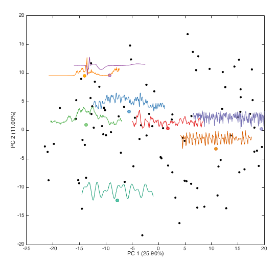

# Low dimensional representations

The software also provides a basic means of visualizing low-dimensional representations of the data, using PCA as `TS_PlotLowDim`.

This can be done for a time-series dataset as follows:

```matlab
TS_PlotLowDim('norm','pca');
```

This uses the normalized data (specifying `'norm'`), plotting time series in the reduced, two-dimensional principal components space of operations (the leading two principal components of the data matrix).

By default, the user will be prompted to select 10 points on the plot to annotate with their corresponding time series, which are annotated as the first 300 points of that time series (and their names by default).

After selecting 10 points, we have the following:


The proportion of variance explained by each principal component is provided in parentheses in the axis label.

## Customizing annotations

Annotation properties can be altered with some detail by specifying properties as the `annotateParams` input variable, for example:

```matlab
% Set whether to plot marginal distributions:
showDistributions = false;
% Set up the annotateParams structure:
annotateParams = struct;
annotateParams.n = 8; % annotate 8 time series
annotateParams.maxL = 150; % annotates the first 150 samples of time series
annotateParams.userInput = false; % points not selected by user but allocated randomly
annotateParams.textAnnotation = false; % don't display names of annotated time series

% Generate a plot using these settings:
TS_PlotLowDim('norm','pca',showDistributions,'',annotateParams);
```

which yields:



## Plotting grouped time series

If groups of time series have been specified (using `TS_LabelGroups`), then these are automatically recognized by `TS_PlotLowDim`, which will then distinguish the labeled groups in the resulting 2-dimensional annotated time-series plot.

Consider the sample dataset containing 20 periodic signals with additive noise (given the keyword **noisy** in the database), and 20 purely periodic signals (given the keyword **periodic** in the database).
After retrieving and normalizing the data, we store the two groups in the metadata for the normalized dataset **HCTSA_N.mat**:

```matlab
TS_LabelGroups('norm',{'noisy','periodic'},'ts');
```
```
We found:
noisy -- 20 matches
periodic -- 20 matches
Saving group labels and information back to HCTSA_N.mat... Saved.
```
Now when we plot the dataset in `TS_PlotLowDim`, it will automatically distinguish the groups in the plot and attempt to classify the difference in the reduced principal components space.

Running the following:

```matlab
annotateParams = struct('n',6); % annotate 6 time series
showDistributions = true; % plot marginal distributions
TS_PlotLowDim('norm','pca',showDistributions,'',annotateParams);
```

The function then directs you to select 6 points to annotate time series to, producing the following:


Notice how the two labeled groups have been distinguished as red and blue points, and a linear classification boundary has been added (with in-sample misclassification rate annotated to the title and to each individual principal component).
If marginal distributions are plotted (setting `showDistribution = true` above), they are labeled according to the same colors.
