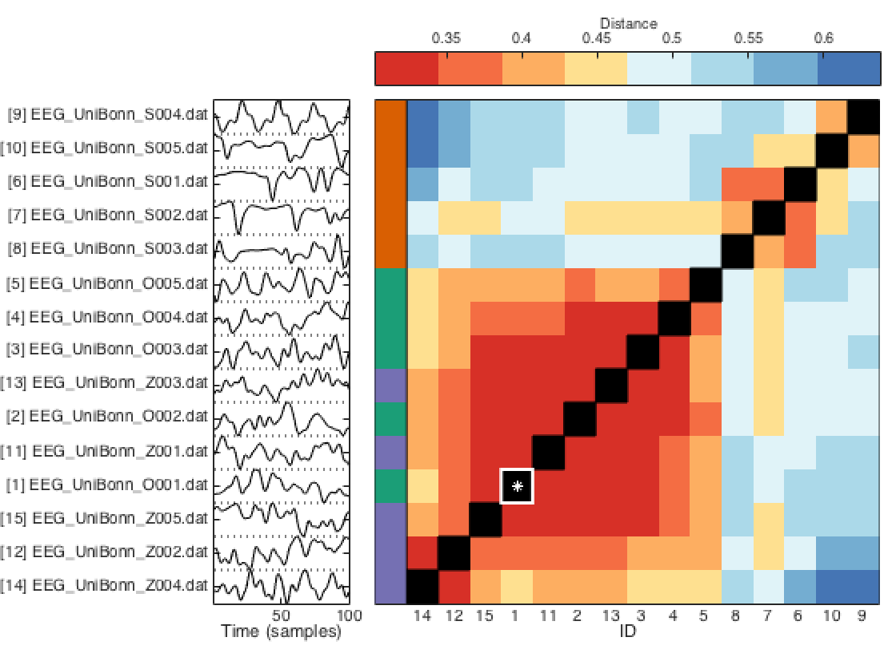
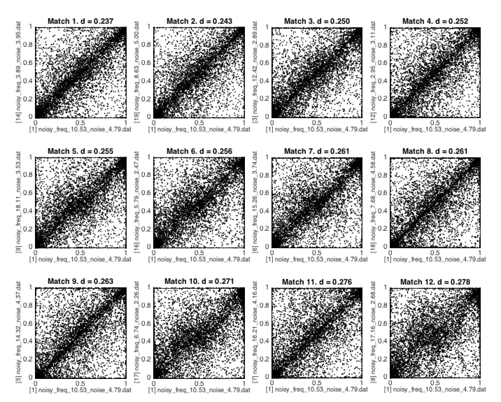

# Visualizing the nearest neighbors of a time series using `TS_SimSearch`

While the global structure of a time-series dataset can be investigated by plotting the data matrix ([`TS_plot_DataMatrix`](visualizing_the_data_matrix.md)) or a low-dimensional representation of it ([`TS_plot_pca`](low_dim.md)), sometimes it can be more interesting to retrieve and visualize relationships between a set of nearest neighbors to a particular time series of interest.

The *hctsa* framework provides a way to easily compute distances between pairs of time series, e.g., as a Euclidean distance between their normalized feature vectors.
This allows very different time series (in terms of their origin, their method of recording and measurement, and their number of samples) to be compared straightforwardly according to their properties, measured by the algorithms in our *hctsa* library.

For this, we use the `TS_SimSearch` function, specifying the id of the time series of interest (i.e., the `ID` field of the `TimeSeries` structure) with the first input and the number of neighbors with the 'numNeighbors' input specifier (default: 20).
By default, data is loaded from `HCTSA_N.loc`, but a custom source can be specified using the `'whatDataFile'` input specifier (e.g., `TS_SimSearch('whatDataFile','HCTSA_custom.mat')`).

After specifying the target and how many neighbors to retrieve, `TS_SimSearch` outputs the list of neighbors and their distances to screen, and the function also provides a range of plotting options to visualize the neighbors.
The plots to produce are specified as a cell using the 'whatPlots' input.

## Pairwise similarity matrix of neighbors

    TS_SimSearch('whatPlots',{'matrix'});

To investigate the pairwise relationships between all neighbors retrieved, you specify the `'matrix'` option of the `TS_SimSearch` function.
An example output using a publicly-available [EEG dataset](http://epileptologie-bonn.de/cms/front_content.php?idcat=193&lang=3), retrieving 14 neighbors from the time series with ID = 1, as `TS_SimSearch(1,'whatPlots',{'matrix'},'numNeighbors',14)`, is shown below:

The specified target time series (`ID = 1`) is shown as a white star, and all 14 neighbors are shown, as labeled on the left of the plot with their respective IDs, and a 100-sample subset of their time traces.

Pairwise distances are computed between all pairs of time series (as a Euclidean distance between their feature vectors), and plotted using color, from low (red = more similar pairs of time series) to high (blue = more different pairs of time series).

Because this dataset contains 3 classes that were previously labeled (using [`TS_LabelGroups`](grouping.md) as: `TS_LabelGroups({'seizure','eyesOpen','eyesClosed'})`), the function shows these class assignments using color labels to the left of the plot (purple, green, and orange in this case).

In this case we see that the purple and green classes are relatively similar under this distance metric (eyes open and eyes closed), whereas the orange time series (seizure) are distinguished.

## Network of neighbors

Another way to visualize the similarity (under our feature-based distance metric) of all pairs of neighbors is using a network visualization.
This is specified as:

    TS_SimSearch(1,'whatPlots',{'network'});

which produces something like the following:

The strongest links are visualized as blue lines (by default, the top 40% of strongest links are plotted, cf. the legend showing 0.9, 0.8, 0.7, and 0.6 for the top 10%, 20%, 30%, and 40% of links, respectivly).

The target is distinguished (as purple in this case), and the other classes of time series are shown using color, with names and time-series segments annotated.
Again, you can see that the EEG time series during seizure (blue) are distinguished from eyes open (red) and eyes closed (green).

## Pairwise similarity matrix of neighbors

    TS_SimSearch(1,'whatPlots',{'scatter'});

The scatter setting visualizes the relationship between the target and each of 12 time series with the most similar properties to the target.
Each subplot is a scatter of the (normalized) outputs of each feature for the specified target (x-axis) and the match (y-axis).
An example is shown below.

## Other details

Multiple output plots can be produced simultaneously by specifying many types of plots as follows:

    TS_SimSearch(1,'whatPlots',{'matrix','network','scatter'})

This produces a plot of each type.

Note that pairwise distances can be pre-computed and saved in the `HCTSA*.mat` file using `TS_PairwiseDist` for custom distance metrics (which is done by default in `TS_cluster` for datasets containing fewer than 1000 objects).
`TS_SimSearch` checks for this information in the specified input data (containing the `ts_clust` or `op_clust` structure), and uses it to retrieve neighbors.
If distances have not previously been computed, distances from the target are computed as euclidean distances (time series) or absolute correlation distances (operations) between feature vectors within `TS_SimSearch`.
