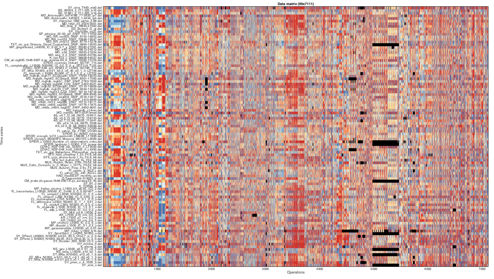

# Visualizing the data matrix using `TS_plot_DataMatrix`
<!--{#sec:visualizing}-->

<!--There are many tasks that involve understanding the rich structure contained in data matrices by visualizing them.-->
<!--In this section we describe some basic tools we have developed to visualize the behavior of time series and operations in the data matrix.-->

<!--### Visualizing the data matrix using -->
<!--{#sec:visDatamatrix}-->

The clustered data matrix (if clustering has been performed, otherwise the non-clustered data matrix is used) can be visualized by running

        TS_plot_DataMatrix

This will produce a colored visualization of the data matrix such as that shown below.

When data is grouped according to a set of distinct keywords and stored as group metadata (using the `TS_LabelGroups` [function](grouping.md)), these can also be visualized using `TS_plot_DataMatrix('colorGroups',1)`.

## Example usage

For example, we used a set of 9000 operations on 100 diverse empirical time series.
We then:
1. Normalized it, using `TS_normalize('scaledRobustSigmoid',[0.7,0.9])`. This removed 1 time series with fewer than 70% good values, 2476 operations with fewer than 90% good values, 164 operations with near-constant outputs, and 114 operations with zero interquartile range, leaving a 99 x 7225 normalized data matrix containing 0.38% special values saved in **HCTSA_N.mat**.
2. Clustered it, using `TS_cluster('euclidean','average', 'corr_fast', 'average')`, which uses a faster approximation for correlations involving bad values. The result is a re-ordered data matrix and associated metadata saved in **HCTSA_N.mat**.

### Visualizing the normalized (unclustered) data matrix
Running `TS_plot_DataMatrix('norm')` plots the data contained in **HCTSA_N.mat**, yielding:

where black rectangles label missing values, and other values are shown from low (blue) to high (red) after normalization using the scaled outlier-robust sigmoidal transformation.
Due to the size of the matrix, operations are not labeled.

### Visualizing the clustered data matrix

It can be useful to display the matrix with the order of time series and operations preserved, but the relationships between rows and columns can be difficult to visualize.

Running `TS_plot_DataMatrix('cl')`, plots the data contained in **HCTSA_cl.mat**, yielding:

By reordering rows and columns, this representation reveals correlated patterns of outputs across different types of operations, and similar sets of properties between different types of time series.

## Example: Incorporating group information

In this example, we consider a set of 20 periodic and 20 noisy periodic signals.
After retrieving the data (`SQL_retrieve`), we then assigned the time series to groups (using `TS_LabelGroups('orig',{'periodic','noisy'},'ts')`), normalized the data matrix (`TS_normalize`), and then clustered it (`TS_cluster`).
So now we have a clustered data matrix containing thousands of summaries of each time series, as well as pre-assigned group information as to which time series are periodic and which are noisy.
When the time series have been assigned to groups , this can be accessed by setting the second input to 1:

    plotGroups = 0;
    TS_plot_DataMatrix('colorGroups',plotGroups);
    plotGroups = 1;
    TS_plot_DataMatrix('colorGroups',plotGroups);
    
producing the following two plots:

When group information is not used (the left plot), the data is visualized in the normal blue/yellow/red color scheme, but when the pre-assigned groups are shown, we see that the clustered dataset separates perfectly into the two assigned groups (shown in green and blue colormap).